<div align="center">

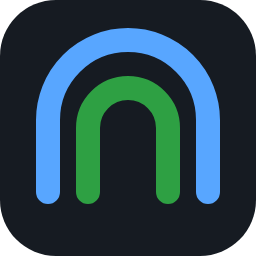

# TunnelTab

### Your servers, one click away.

A portable SSH terminal and web-UI launcher for your own VPSs.<br>
**No install. No accounts. No cloud.**

[](https://github.com/Aerobit/TunnelTab/releases/latest)
&nbsp;
[](#-quick-start)

[](https://github.com/Aerobit/TunnelTab/actions/workflows/ci.yml)
[](LICENSE)
[](https://go.dev)

[Features](#-features) · [Screenshots](#-screenshots) · [Quick start](#-quick-start) · [Security](#-security) · [FAQ](#-faq) · [User guide](docs/USER_GUIDE.md) · [Changelog](CHANGELOG.md)

<br>

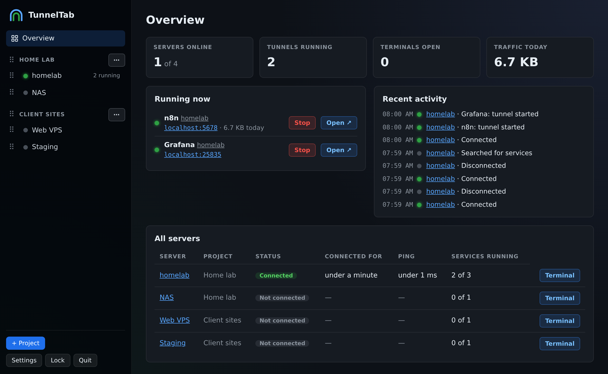

<sub><b>Overview</b>: what's online, what's running and what just happened, across all your servers.</sub>

</div>

<br>

## 💡 Why TunnelTab?

Your self-hosted apps (n8n, Portainer, Grafana, admin panels) shouldn't be
open to the internet, so you reach them through SSH tunnels. That usually
means remembering `ssh -L 5678:localhost:5678 …` commands, keeping terminal
windows open, and starting over after every Wi-Fi drop.

**TunnelTab turns all of that into buttons.** Add your servers once, then
click **Open ↗** to reach a web app or **+ New terminal** to get a shell, right
in your browser.

## ✨ Features

<table>
<tr>
<td width="33%" valign="top">

### 🖥️ Terminals in the page
Real SSH shells inside the dashboard: several per server, **Split** side
by side, or **Pop out** to their own tab. They reconnect by themselves
after a network drop.

</td>
<td width="33%" valign="top">

### 🚀 One-click web UIs
Click **Open ↗** on a service. TunnelTab starts the SSH tunnel and opens
the page for you, on `localhost` only.

</td>
<td width="33%" valign="top">

### 🔎 Find services
Don't know the port? **Find services** lists the web apps a server runs
(n8n, Grafana, Portainer, Home Assistant…), checks that each one answers,
and adds the ones you tick.

</td>
</tr>
<tr>
<td valign="top">

### 📊 See how a server is doing
Ping, uptime, reconnects and the traffic through each tunnel. Click
**Connect** to see CPU load, memory and disk use live.

</td>
<td valign="top">

### 🗂️ Organised by project
Group servers into projects and keep notes on each one (stored
encrypted). Drag, or use the keyboard, to reorder.

</td>
<td valign="top">

### 🔄 Stays connected
Tunnels and terminals recover after Wi-Fi drops or sleep. Auto-lock
protects a PC you walk away from.

</td>
</tr>
<tr>
<td valign="top">

### 🔐 Secure by design
Secrets live in an encrypted vault. Server fingerprints are verified.
Everything stays on `127.0.0.1`.

</td>
<td valign="top">

### 💼 Truly portable
One folder for Windows and Linux. Copy it to another PC or a USB stick
and carry on.

</td>
<td valign="top">

### ✍️ Signed updates
**Update now** installs a new version in one click, only if it's signed
by TunnelTab. It never checks by itself.

</td>
</tr>
</table>

**Log in your way:** SSH agent · a key stored in the vault · a key file · a password

## 📸 Screenshots

<table>
<tr>
<td width="50%">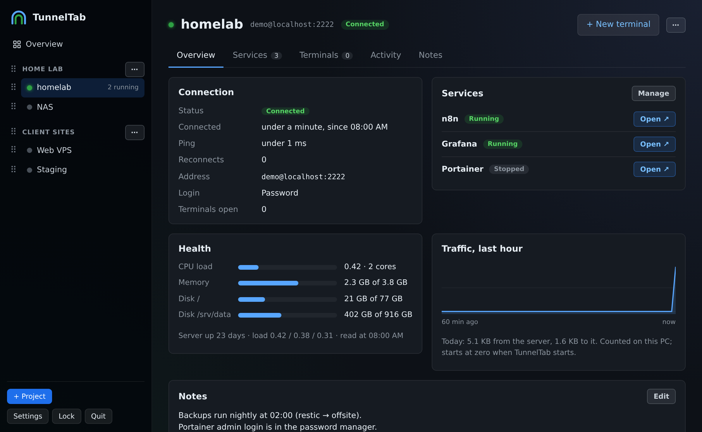</td>
<td width="50%">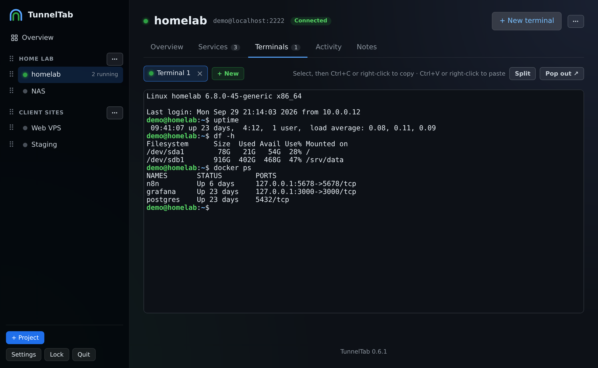</td>
</tr>
<tr>
<td align="center"><b>Server page</b><br><sub>Connection, services, health, traffic and notes</sub></td>
<td align="center"><b>Terminal</b><br><sub>A real SSH shell in the page; split it or pop it out</sub></td>
</tr>
<tr>
<td>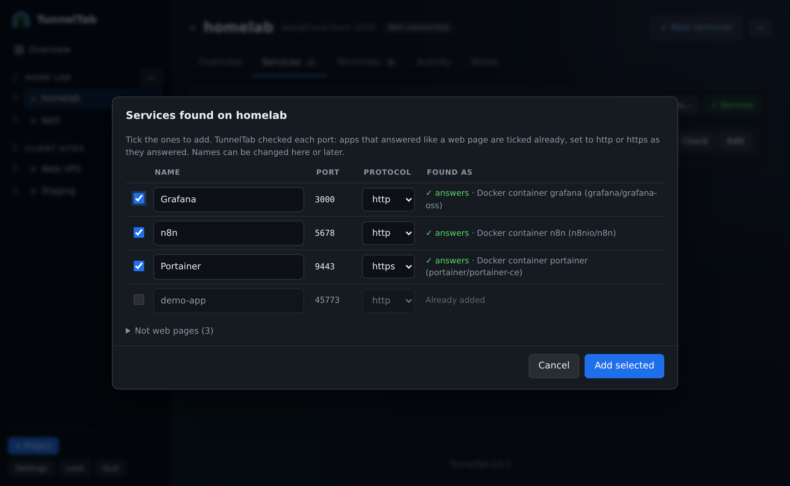</td>
<td>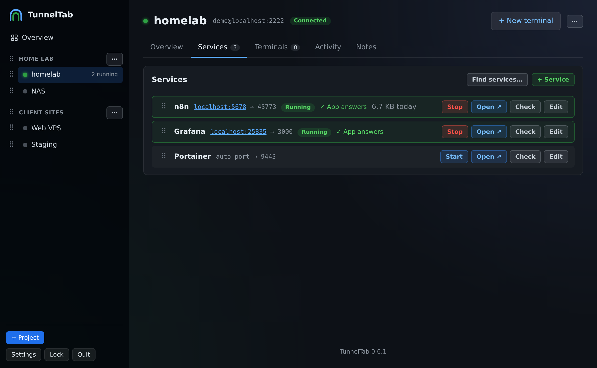</td>
</tr>
<tr>
<td align="center"><b>Find services</b><br><sub>Recognised apps are ticked already</sub></td>
<td align="center"><b>Services</b><br><sub>Start, stop, open and reorder</sub></td>
</tr>
</table>

<details>
<summary><b>More screenshots</b>: fingerprint check, adding a server, settings, first run, unlock</summary>
<br>

<table>
<tr>
<td width="50%">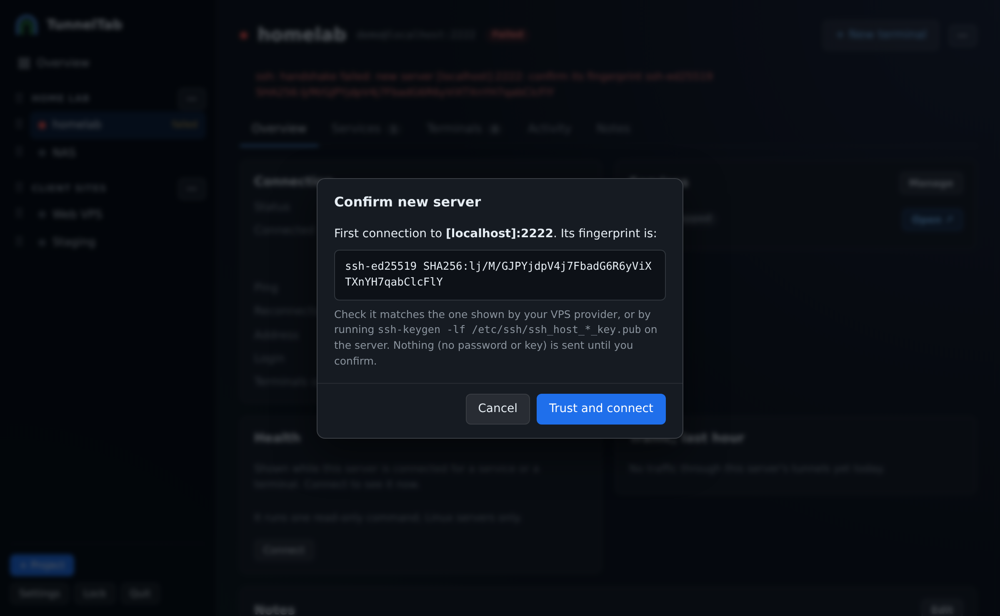</td>
<td width="50%">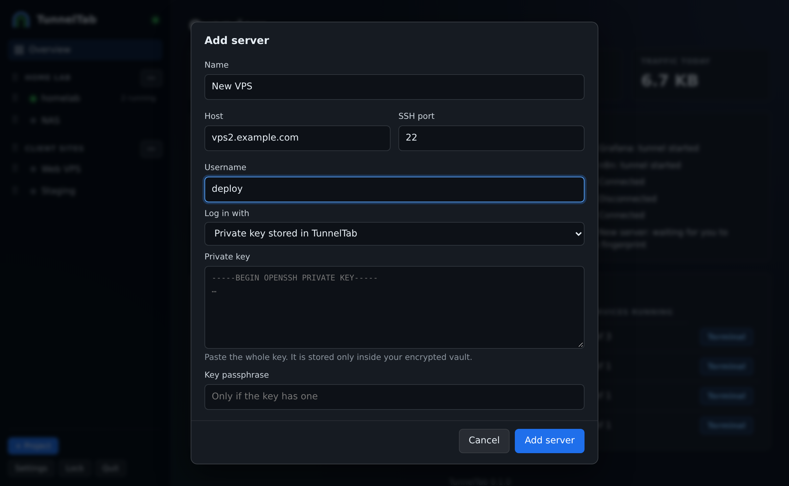</td>
</tr>
<tr>
<td align="center"><b>Fingerprint check</b><br><sub>Nothing is sent until you confirm the server</sub></td>
<td align="center"><b>Add a server</b><br><sub>Agent, stored key, key file or password</sub></td>
</tr>
<tr>
<td>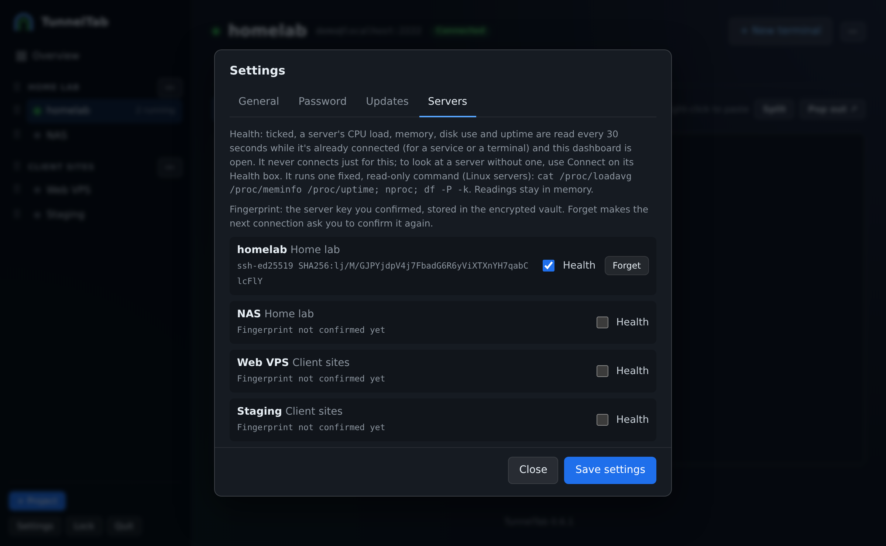</td>
<td>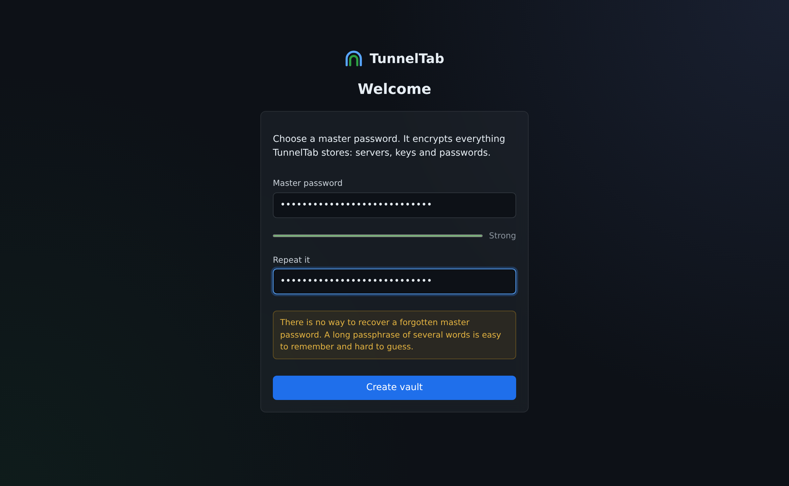</td>
</tr>
<tr>
<td align="center"><b>Settings</b><br><sub>Health and fingerprint for each server</sub></td>
<td align="center"><b>First run</b><br><sub>Choose a master password</sub></td>
</tr>
<tr>
<td>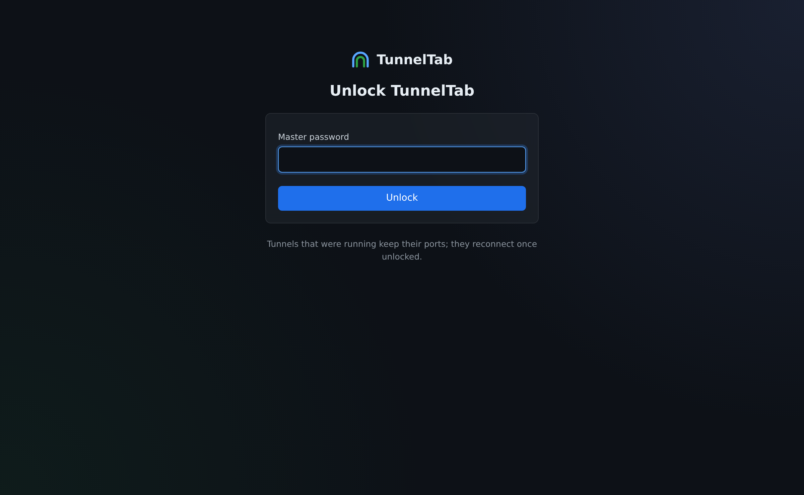</td>
<td></td>
</tr>
<tr>
<td align="center"><b>Unlock</b><br><sub>Everything stays encrypted until you do</sub></td>
<td></td>
</tr>
</table>

</details>

<sub>Screenshots use made-up demo data (see [docs/images](docs/images/README.md)).</sub>

## ⚡ Quick start

> **Needs:** Windows 10/11 or Linux (64-bit) and any modern browser.
> Nothing to install on your PC or your servers.

1. **Download** the latest `tunneltab-<version>.zip` from
   [Releases](https://github.com/Aerobit/TunnelTab/releases/latest) and
   **extract** it anywhere (Documents, a USB stick…).
2. **Run it:**
   - **Windows:** double-click `tunneltab.exe`
   - **Linux:** `./tunneltab-linux-amd64`
3. **Set up:** your browser opens the dashboard. Create a master password,
   add a server, and click **+ New terminal** or **Open ↗**.

> [!NOTE]
> On Windows, SmartScreen may warn you because the app isn't code-signed.
> Click **More info → Run anyway**.

📖 Full instructions, troubleshooting and FAQ: **[User guide](docs/USER_GUIDE.md)**

## 🧭 How it works

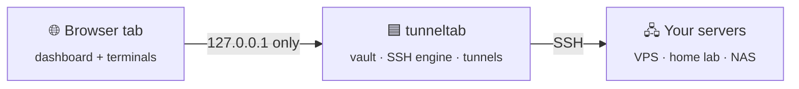

TunnelTab is a single Go program with its own SSH client, so it doesn't need
OpenSSH, sshpass, Node.js or a browser extension. Details:
[docs/ARCHITECTURE.md](docs/ARCHITECTURE.md).

## 🛡️ Security

| | |
|---|---|
| 🔑 **Encrypted vault** | Credentials are encrypted with a key derived from your master password (Argon2id + AES-256-GCM) and never leave the app. |
| 🏠 **Local only** | The dashboard and every tunnel listen on `127.0.0.1`. Other devices and websites can't use them. |
| 🔍 **Verified servers** | New server fingerprints must be confirmed. Changed fingerprints are blocked. |
| 🔒 **Auto-lock** | The vault locks after inactivity (15 min by default) and the key is wiped from memory. |
| 📡 **No phoning home** | TunnelTab contacts only your servers, plus GitHub when *you* click **Check for updates** or **Update now**. |
| ✍️ **Signed updates** | **Update now** installs a new version only if it's signed with TunnelTab's release key. Your data folder is never touched. |
| 🩺 **Health only when you ask** | Load, memory and disk are read with one fixed, read-only command, only after you click **Connect** or tick the server in Settings. **Find services** runs another read-only command, only when you click it. |

Read [SECURITY.md](docs/SECURITY.md) for the full threat model, including
what TunnelTab does **not** protect against, and
[SECURITY_REVIEW.md](docs/SECURITY_REVIEW.md) for the pre-release review.

## ❓ FAQ

<details>
<summary><b>Does it need an account, a server component or Tailscale?</b></summary>
<br>
No. It talks SSH directly to your servers, like the <code>ssh</code> command does.
</details>

<details>
<summary><b>Which servers work?</b></summary>
<br>
Any server you can reach with SSH: VPSs, home servers, Raspberry Pis, NAS
boxes. Nothing needs to be installed on the server.
</details>

<details>
<summary><b>Can I use it on several PCs?</b></summary>
<br>
Yes. Copy the folder, or keep it on a USB stick or in a synced folder. Just
don't run the <i>same</i> folder on two PCs at once.
</details>

<details>
<summary><b>Why does it open in my browser instead of its own window?</b></summary>
<br>
So it doesn't need to bundle a browser engine. The program stays small and
portable, and you get your browser's tabs and zoom.
</details>

<details>
<summary><b>How do I update without losing my servers?</b></summary>
<br>
Open <b>Settings → Check for updates → Update now</b>. TunnelTab downloads
the new version, checks its signature and restarts. Everything you saved
stays in the <code>data</code> folder, which updates never touch. Manual
steps: <a href="docs/USER_GUIDE.md#faq">User guide → FAQ</a>.
</details>

<details>
<summary><b>I forgot my master password.</b></summary>
<br>
There's no way to recover it. That's what keeps a stolen copy useless.
Delete the <code>data</code> folder and start again. Your servers' own
passwords and keys are unaffected.
</details>

## 🛠️ Building from source

<details>
<summary>You need <a href="https://go.dev/dl/">Go</a> 1.27 or newer.</summary>
<br>

```bash
bash scripts/build.sh          # Linux/macOS/WSL
.\scripts\build.ps1            # Windows PowerShell
```

Both produce `dist/tunneltab/` and `dist/tunneltab-<version>.zip`. See
[docs/DEVELOPMENT.md](docs/DEVELOPMENT.md) for tests, the browser test and
how releases are made. Contributions and AI-assisted edits follow
[CLAUDE.md](CLAUDE.md).

</details>

## 📄 License

[MIT](LICENSE). Bundled third-party software (Go, x/crypto, x/sys,
coder/websocket, xterm.js) is listed with its licenses in
`THIRD_PARTY_NOTICES.txt` inside every release.

<div align="center">
<br>
<sub>TunnelTab is the successor to the <code>local.browser</code> browser extension.</sub>
</div>
